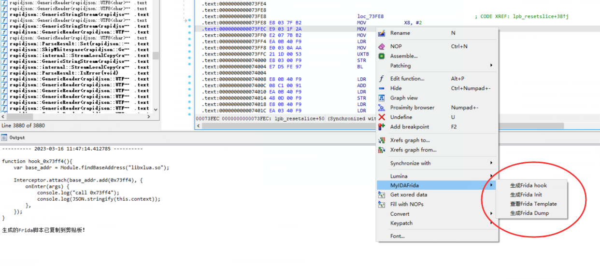

# MyIdaFrida

通过Ida插件生成frida脚本

## 用法

1. 双击反汇编窗口 自动生成对应的inlinehook frida脚本
2. 右键菜单 选择 MyIDAFrida 可以生成对应的脚本
3. 函数窗口列表多选 右键菜单可以批量生成Frida Hook

## 学习来源

1. ShowFridaCode -by lilac
2. https://github.com/P4nda0s/IDAFrida  -by P4nda0s
